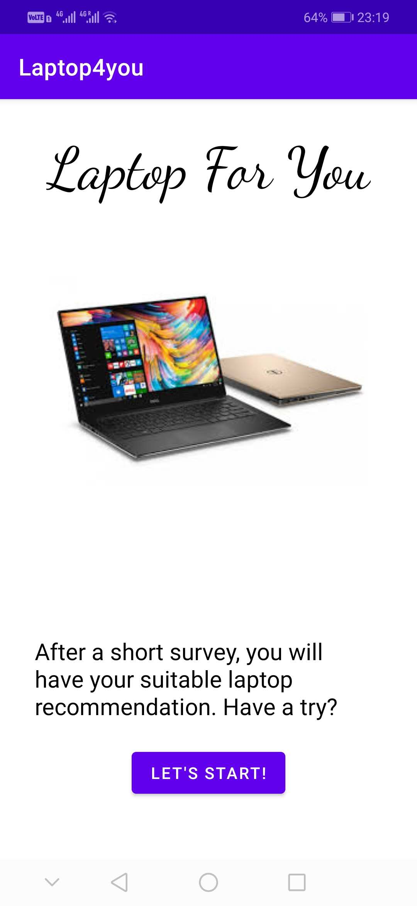

## SECTION 1 : PROJECT TITLE
## LAPTOP4YOU - Laptops Recommender System

---

## SECTION 2 : EXECUTIVE SUMMARY / PAPER ABSTRACT
Since the appearance of home computers in the 1970s, computers have become the basic configuration for more and more families, individuals and companies. The rapid development of semiconductor hardware with its smaller and smaller sizes and stronger computing power also promoted computers to become an indispensable part of personal work, life and entertainment. At present, laptops have become one of the most popular electronic devices because of their lightness and efficiency.

Because of the increasing demand for laptop computers, there are many products on the market, with various models and configurations, which makes choosing a laptop that suits you a little complicated. Even an expert of the laptop will find it is hard to give a recommendation to people, for it is a very customized question. Is there a way to make people who do not have professional knowledge choose a computer that suits them? This is exactly what we hope this system can solve, which will save people a lot of time and money.

This project brings to users a light, elegant and efficient laptop recommendation application on Android devices. It only requires the users to answer 3-5 simple questions like what they would use the laptop for to get users’ preference. After inquiring about our rule based system, the app will feedback the users with many recommendations of laptops with details of model, specs, price and image. Users will get their recommendation in minutes, which meets people’s demand perfectly and saves a lot of time from collecting all the knowledge and information by themselves.
 

---

## SECTION 3 : CREDITS / PROJECT CONTRIBUTION

| Official Full Name  | Student ID (MTech Applicable)  | Work Items (Who Did What) | Email (Optional) |
| :------------ |:---------------:| :-----| :-----|
| Li Jieyu | A0215428H | build rule-based system, android front-end, documentation | lijieyu@u.nus.edu |
| Wang Jiaxin | A0215427J | python crawler, data cleaning, clustering, build database | wangjiaxin@u.nus.edu |

---

## SECTION 4 : VIDEO OF SYSTEM MODELLING & USE CASE DEMO

<video src="https://github.com/jacey-wjx/IRS-PM-2020-10-30-IS02FT-GRP10-LAPTOP4YOU/blob/master/Video/IRS-PM-2020-10-30-IS02FT-GRP10-LAPTOP4YOU.mp4" controls="controls" width="854" height="480">
您的浏览器不支持播放该视频！
</video>

---

## SECTION 5 : USER GUIDE

`Refer to appendix <Installation & User Guide> in project report at Github Folder: ProjectReport`

This app is temporarily hosted on a free distribution platform, so you can click the link below if you want to download:
http://app.dongshijinrong.com/app.php/xyfhsp1hf4rdw

If the link fails, you can download the apk file directly, click [here](https://github.com/jacey-wjx/IRS-PM-2020-10-30-IS02FT-GRP10-LAPTOP4YOU/blob/master/Miscellaneous/base.apk)

---
## SECTION 6 : PROJECT REPORT / PAPER

`Refer to project report at Github Folder: ProjectReport`

**Recommended Sections for Project Report / Paper:**
- BUSINESS PROPOSITION	3
- PROJECT OBJECTIVE	3
- PROJECT SOLUTION	3
- SYSTEM ARCHITECTURE	3
- DATA  RESOURCES	4
- KNOWLEDGE REPRESENTATION	6
- LAPTOP CONFIGURATION	6
- USER PREFERENCE	6
- RELATION OF CONFIGURATION AND PREFERENCE	8
- TECHNICAL APPROACH	11
- FRONT-END DEVELOPMENT	11
- MODELS	15
- Data preprocess	15
- Cluster Model and Performance	16
- Database	17
- Rule-Based System	19
- CONCLUSION	21
- REFERENCE	21
- Appendix 1: Project Proposal	22
- Appendix 2: System Functionalities and Course Work Knowledge	30
- Appendix 3: Installation and User Guide	31
- Appendix 4: Individual Project Report	32
- Appendix 5: Project Non-Disclosure Agreement (NDA)	33

---
## SECTION 7 : MISCELLANEOUS

`Refer to Github Folder: Miscellaneous`

### base.apk
* the android app
### benchmark.csv & laptop_data.csv
* the data used by testing
### LaptopDB.db
* the database used by the project

---

